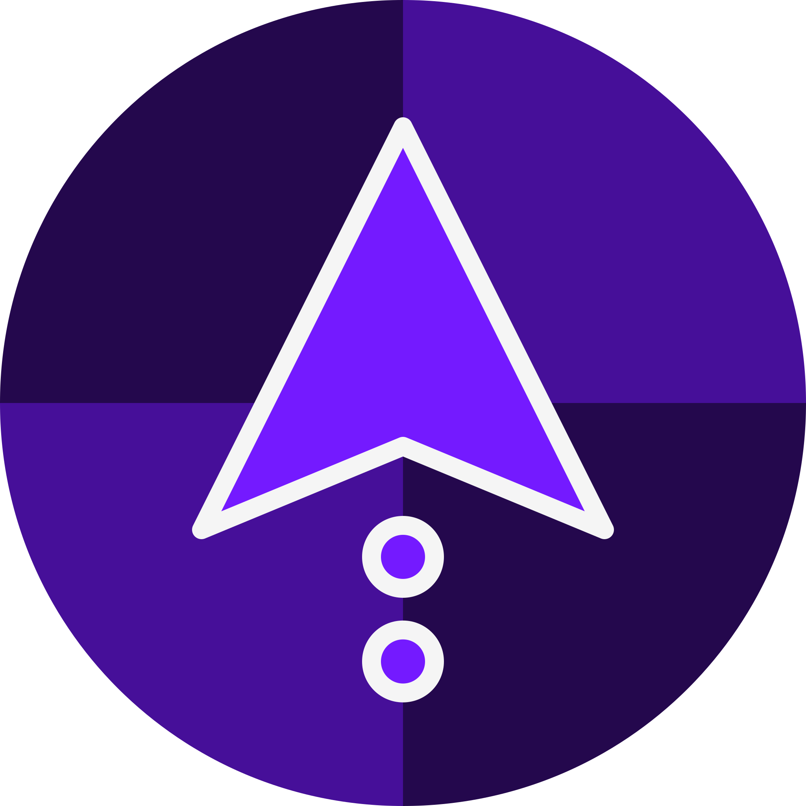

# Jumpvalley Documentation

Welcome to Jumpvalley's documentation! This site contains documentation of Jumpvalley's core API.

This site was built using [Doxygen](https://www.doxygen.nl/).

## Some links that might be of interest

- [Jumpvalley's Git repository on GitHub](https://github.com/UTheCat/jumpvalley)
- [Godot documentation](https://docs.godotengine.org/en/stable/)
